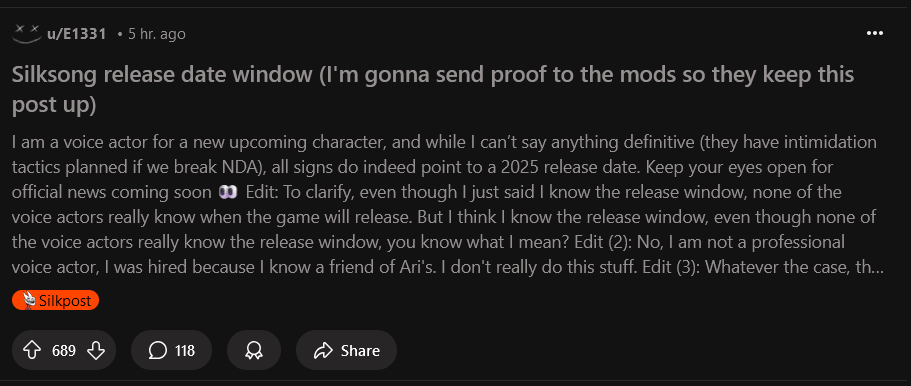
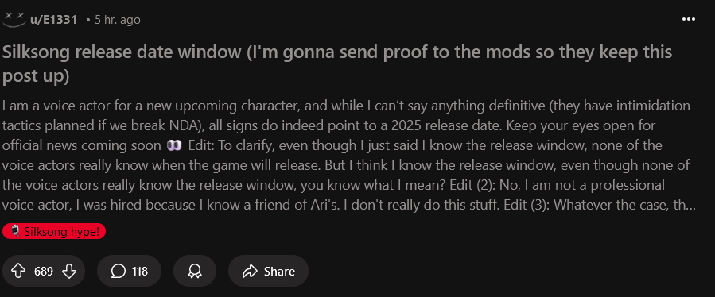

#  Silksong.exe

Change every post with Silkpost flair to other flairs on [r/Silksong](https://www.reddit.com/r/Silksong/)

[Thanks for u/Multifruit256 for the idea.](https://www.reddit.com/r/Silksong/comments/1i7bb4h/we_should_make_a_computer_virus_called/)

Before:

After:

## Features

- Flair is consistent. Same post, same flair
- Small portion of Silkposts remain Silkposts to keep it realistic
- Work for both old Reddit and new
- Get Silksong hypes every day
- Get hopium

## Disclaimer

This project **is not affiliated to Team Cherry, nor is affiliated to r/Silksong modteams**.