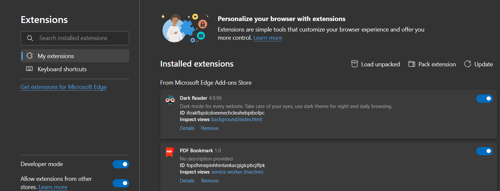

#  Silksong.exe

Change every post with Silkpost flair to other flairs on [r/Silksong](https://www.reddit.com/r/Silksong/)

[Thanks for u/Multifruit256 for the idea.](https://www.reddit.com/r/Silksong/comments/1i7bb4h/we_should_make_a_computer_virus_called/)

Before:

After:

## Features

- Flair is consistent. Same post, same flair
- Small portion of Silkposts remain Silkposts to keep it realistic
- Work for both old Reddit and new
- Get Silksong hypes every day
- Get hopium

## Install

It's only available on Firefox at the moment. However it should also be working on Chromium browsers, but it would probably never be on Chrome Web Store as I don't have developer account and I have to pay $5 to be one. I am waiting for Edge's approval at this point. Before this happens you need to do a manual installation. 

### Firefox

https://addons.mozilla.org/en-GB/firefox/addon/silksong-exe/

### Edge

Download the latest [`silkpost-extension.zip`](https://github.com/CarrieForle/silkpost-extension/releases/latest) from Release page. Unzip it.

Go to [edge://extensions/](edge://extensions/) and turn on "Developer mode" on the left panel.

Click "Load unpacked" and select the extension folder.

The extension is now loaded.

## Disclaimer

This project **is not affiliated to Team Cherry, nor is affiliated to r/Silksong modteams**.